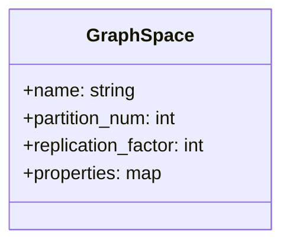
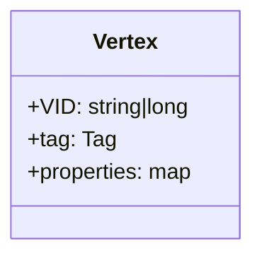
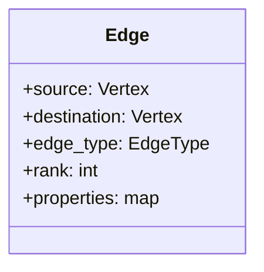
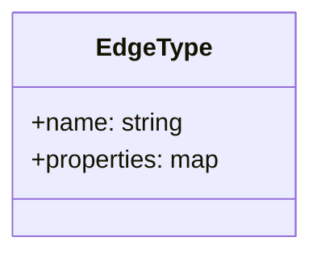
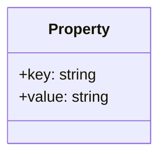

# Data Modeling

* Data modeling for knowledge graph is the process of defining the structure and sematics
  of interconnected data that respresnts real world knowledge, entities and thier relation
  ships so the whole idea is organized data according to their relationship and their weight
  on that relations


## Data Structures (Nebula Graph)

* Nebula Graph models uses six data sturcures

  1) Spaces
  2) Vertices
  3) Edges
  4) Tags
  5) Edge Type
  6) Properties


1) **Graph Spaces**

  * **Description** : A logical container for graph data, used from different teams or
    application. Each graph spcae has its own storage configuration(e.g replication,
    partition), access, privileges and schema

  * **Key Features**

    * Contains vertices and edges.

    * Supports independent settings for storage and security.




2) **Vertices**

  * **Description** : Represent entities (e.g. users, products). Each vertex has a unique
    identifer(VID) and can belong to mutiple tags

  * **Key Features**

    * VID : Unique Identifer (int64 or fixed_string(N))

    * Tags: Tags are oprional in latest version of nebula graph i.e vertices can have zero tags



3) **Edges**

  * **Description** : Edges are directed connection b/w verticrs(nodes), representing relation
    ship (e.g "followers", "ratings"). Edges are uniquely identified by

    * Source Vertex

    * Edge type

    * Rank Value (immutable, for odering multiple edges b/w same vertices)

    * Destination vertex




4) **Edge Types**

  * **Description** : Categories for edges, defining their demantic anf properties. Each edge
    must have exactly one edge type.

  * **Key Features**

    * Each edge type defines properties (keys) for edges

    * Used to enforece consistency in edge metadata.



5) **Properties**

  * **Description** : Key value pairs that stores metadata for vertices and edges

  * **Key Features**

    * Both vertices and edge can have properties.

    * Property keys are defined by tags or edge types.




### Relationship Diagram

```mermaid

graph TD
    G[Graph Space] --> V[Vertex]
    G --> E[Edge]
    
    V --> VID[VID]
    V --> T[Tag]
    T --> P[Properties Keys]
    
    E --> SRC[Source Vertex]
    E --> DEST[Destination Vertex]
    E --> ET[Edge Type]
    E --> R[Rank]
    
    SRC --> V
    DEST --> V
    ET --> P

````

