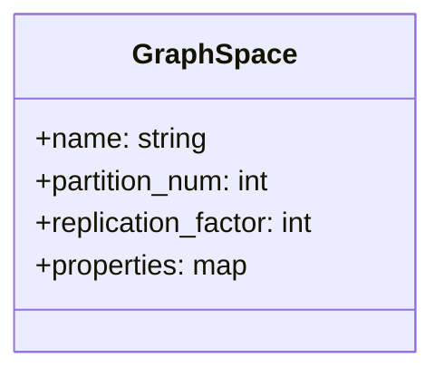
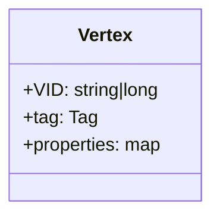
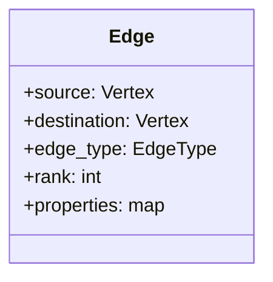
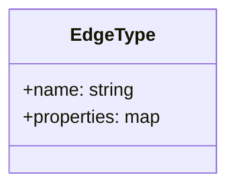
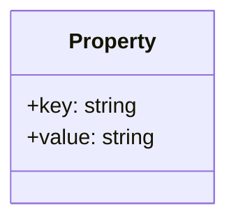
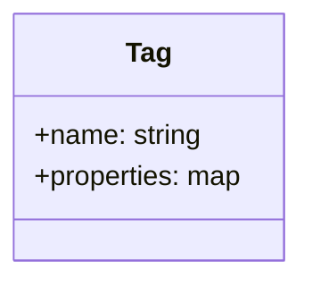
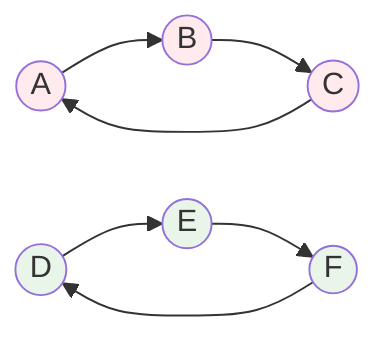
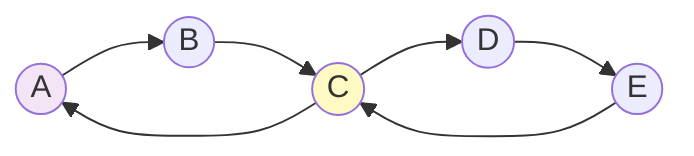
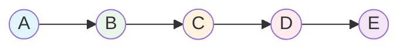

# Data Modeling

* Data modeling for knowledge graph is the process of defining the structure and sematics
  of interconnected data that respresnts real world knowledge, entities and thier relation
  ships so the whole idea is organized data according to their relationship and their weight
  on that relations


## Data Structures (Nebula Graph)

* Nebula Graph models uses six data sturcures

  1) Spaces
  2) Vertices
  3) Edges
  4) Tags
  5) Edge Type
  6) Properties


1) **Graph Spaces**

  * **Description** : A logical container for graph data, used from different teams or
    application. Each graph spcae has its own storage configuration(e.g replication,
    partition), access, privileges and schema

  * **Key Features**

    * Contains vertices and edges.

    * Supports independent settings for storage and security.




2) **Vertices**

  * **Description** : Represent entities (e.g. users, products). Each vertex has a unique
    identifer(VID) and can belong to mutiple tags

  * **Key Features**

    * VID : Unique Identifer (int64 or fixed_string(N))

    * Tags: Tags are oprional in latest version of nebula graph i.e vertices can have zero tags



3) **Edges**

  * **Description** : Edges are directed connection b/w verticrs(nodes), representing relation
    ship (e.g "followers", "ratings"). Edges are uniquely identified by

    * Source Vertex

    * Edge type

    * Rank Value (immutable, for odering multiple edges b/w same vertices)

    * Destination vertex




4) **Edge Types**

  * **Description** : Categories for edges, defining their demantic anf properties. Each edge
    must have exactly one edge type.

  * **Key Features**

    * Each edge type defines properties (keys) for edges

    * Used to enforece consistency in edge metadata.



5) **Properties**

  * **Description** : Key value pairs that stores metadata for vertices and edges

  * **Key Features**

    * Both vertices and edge can have properties.

    * Property keys are defined by tags or edge types.



6) **Tags**
  
  * **Description**: Labels for categorizing vertices (similar to labels in other graph 
    databases). Vertices with the same tag share the same property keys.

  * **Key Features**

    * Each tag defines a set of properties (keys).
    * Properties must be consistent for all vertices using the tag.



### Relationship Diagram

```mermaid

graph TD
    G[Graph Space] --> V[Vertex]
    G --> E[Edge]
    
    V --> VID[VID]
    V --> T[Tag]
    T --> P[Properties Keys]
    
    E --> SRC[Source Vertex]
    E --> DEST[Destination Vertex]
    E --> ET[Edge Type]
    E --> R[Rank]
    
    SRC --> V
    DEST --> V
    ET --> P

````

## Nebula Graph Directed Property graph

  * NebulaGraph stores data in directed property graphs. A directed property graph is a
    graph database structure where verticrs and directed edges are connected and both 
    can have assocaited properties.

  * The graph is represnted as G = <V, E, PV, PE>

    * **V** : A set of vertices (nodes).
    * **E** : A set of directed edges (relationships or connections).
    * **PV** : Property definitions for vertices.
    * **PE** : Property definitions for edges.


---

#### Vertex

  * **Definition**
    
    * A vertex represents an entity in the graph (e.g., a person, an object).
    
    * Each vertex has a unique identifier called VID (Vertex ID).

  * **Key Characteristics**
    
    1) **VID** : Must be unique within a graph space. It can be either int64 or fixed_string(N).
    
    2) **Tags** : Vertices can belong to one or more tags. Tags are used to categorize vertices 
       and define their property schema.

      * Example: In the basketball player dataset, player and team are vertex tags.

    3) Properties: Key-value pairs associated with a vertex. Property keys are defined by tags.
       
      * **Example** : For player tag: name (string) and age (int).

      * For team tag: name (string).

**Example**

|Vertex | Tag	Property Keys |	Description
|-------|-------------------|----------------------------------
|player	| name, age         | Represents players in a team.
|team	  | name	            | Represents teams with their names.

---

####  Edge
  * **Definition**
  
    * An edge represents a directed relationship between two vertices.

    * It is uniquely identified by <source vertex, edge type, rank, destination vertex>.

  * **Key Characteristics**
    
    1) **Directed** : Edges are directed (i.e., they point from one vertex to another).
       
      * **Example** : The edge follow points from a follower to a followee.

    2) **Edge Type** : Each edge has one and only one edge type, which defines its property schema.
      
      * **Example** : In the basketball player dataset, serve and follow are edge types.
    
    3) **Rank** : An immutable 64-bit signed integer used to order edges with the same edge type and source-destination pair.
      
      * **Default** : 0. Higher rank values appear first.
      
      * **Example** : The follow edge type includes a property degree (int) to represent follower ratings.

**Example**

|Edge Type	| Source Vertex	| Destination Vertex	| Properties	                |Description
------------|---------------|---------------------|-----------------------------|------------------
|serve	    | Player	      | Team	              | start_year, end_year (int)	| Represents a player serving a team.
|follow	    | Player	      | Player	            | degree (int)	              | Represents a player following another player on Twitter.

---

## Graph Theory: Path Types 

### Overview
  * In graph theory, a **path** is a finite or infinite sequence of edges which joins a sequence of vertices. Paths are fundamental concepts 
    of graph theory and can be categorized into three main types: **Walk**, **Trail**, and **Path**.


1) **Walk**
  
  * **Definition**
    
    * **walk** is a finite or infinite sequence of edges where:
      
      - Both vertices and edges can be **repeatedly visited** during graph traversal
      
      - No restrictions on repetition

### Key Characteristics
- ✅ Vertices can be repeated
- ✅ Edges can be repeated
- ✅ Can be infinite in length
- 🔄 Allows cycles and loops

### Example Paths
Given a graph with cycle C-D-E:
- `A→B→C→D→E`
- `A→B→C→D→E→C` (revisiting vertex C)
- `A→B→C→D→E→C→D` (revisiting vertices and edges)

### Usage in Graph Databases
- **GO statements** use walk semantics

```mermaid
graph LR
    A((A)) --> B((B))
    B --> C((C))
    C --> D((D))
    D --> E((E))
    E --> C
    
    style A fill:#e1f5fe
    style B fill:#e1f5fe
    style C fill:#fff3e0
    style D fill:#fff3e0
    style E fill:#fff3e0
```

---

## 2. Trail

* **Definition**
  * A **trail** is a finite sequence of edges where:
    
    - Only **vertices** can be repeatedly visited
    
    - **Edges** cannot be repeated

### Key Characteristics
- ✅ Vertices can be repeated
- ❌ Edges cannot be repeated
- ⚠️ Always finite in length
- 📏 Limited by number of unique edges

### Example
In a graph with 5 edges, the longest trail would be: `A→B→C→D→E→C`
- Vertex C is visited twice
- No edge is traversed more than once

### Usage in Graph Databases
- **MATCH statements** use trail semantics
- **FIND PATH statements** use trail semantics  
- **GET SUBGRAPH statements** use trail semantics

### Special Cases of Trail

#### 2.1 Cycle
**Definition**: A closed trail where only terminal vertices can be repeated

**Characteristics**:
- 🔄 Forms a closed loop
- ✅ Start and end vertices are the same
- ❌ No other vertex repetition allowed
- ❌ No edge repetition

**Example**: `A→B→C→A` or `C→D→E→C`



#### 2.2 Circuit
**Definition**: A closed trail where terminal vertices and intermediate vertices can be repeated

**Characteristics**:
- 🔄 Forms a closed loop
- ✅ Start and end vertices are the same
- ✅ Intermediate vertices can be repeated
- ❌ No edge repetition

**Example**: `A→B→C→D→E→C→A`
- Starts and ends at A
- Vertex C is visited twice
- No edge is used twice



---

## 3. Path (Simple Path)

* **Definition**
  
  * A **path** (also called simple path) is a finite sequence of edges where:
    
    - **Neither vertices nor edges** can be repeatedly visited
    
    - Most restrictive type of path

### Key Characteristics
- ❌ Vertices cannot be repeated
- ❌ Edges cannot be repeated
- ⚠️ Always finite in length
- 📏 Limited by number of unique vertices - 1

### Example
In a graph with 5 vertices, the longest simple path would be: `A→B→C→D→E`
- Each vertex visited exactly once
- Each edge traversed exactly once



---

## Quick Comparison Table

| Path Type | Vertex Repetition | Edge Repetition | Length | Example |
|-----------|------------------|-----------------|---------|---------|
| **Walk** | ✅ Allowed | ✅ Allowed | Infinite possible | `A→B→C→D→E→C→D` |
| **Trail** | ✅ Allowed | ❌ Not allowed | Finite | `A→B→C→D→E→C` |
| **Path** | ❌ Not allowed | ❌ Not allowed | Finite | `A→B→C→D→E` |

### Trail Subtypes
| Subtype | Description | Vertex Repetition | Edge Repetition |
|---------|-------------|------------------|-----------------|
| **Cycle** | Closed trail, only terminals repeat | ✅ Terminal only | ❌ Not allowed |
| **Circuit** | Closed trail, any vertex can repeat | ✅ Allowed | ❌ Not allowed |

---

## Practical Applications

### Graph Database Queries
- **Walk-based**: `GO` statements for exploring all possible paths including cycles
- **Trail-based**: `MATCH`, `FIND PATH`, `GET SUBGRAPH` for finding paths without edge repetition
- **Path-based**: Finding shortest or simple paths between vertices

### Real-world Examples
- **Walk**: Web crawling (can revisit pages and links)
- **Trail**: Seven Bridges of Königsberg problem
- **Path**: Finding shortest route between cities (each city visited once)

---

## Memory Tips

1. **Walk**: Most permissive - "walk anywhere, anytime"
2. **Trail**: Middle ground - "leave a trail, don't repeat steps"
3. **Path**: Most restrictive - "simple and direct path"
